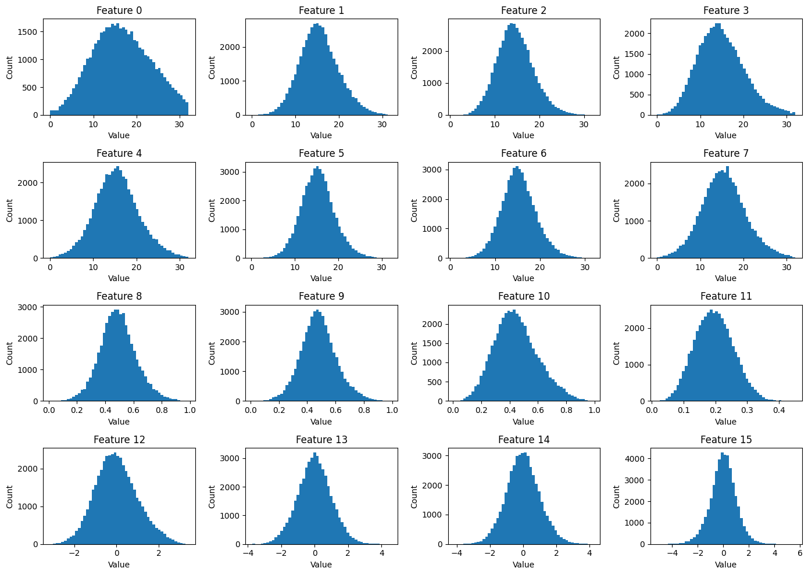
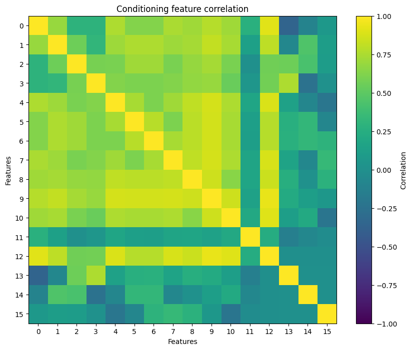
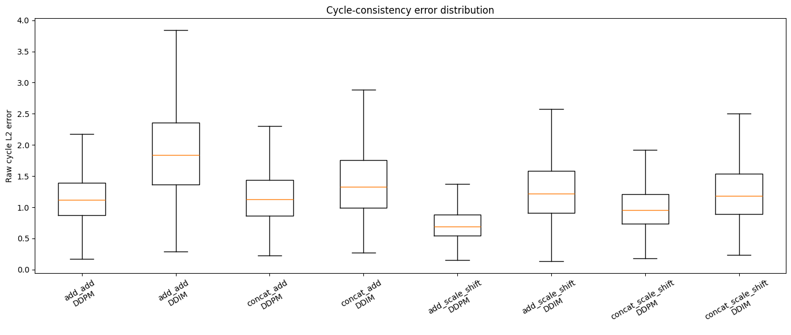
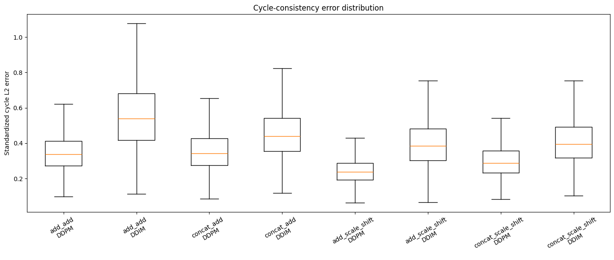
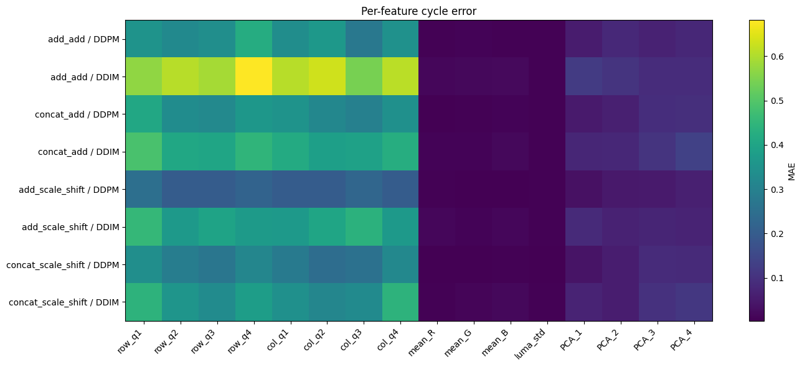
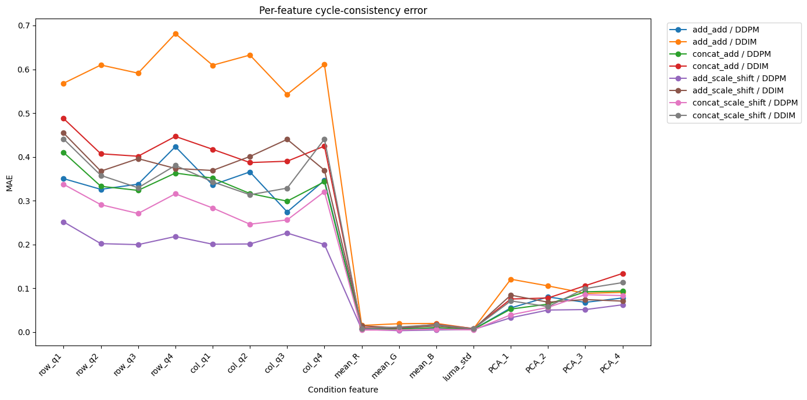
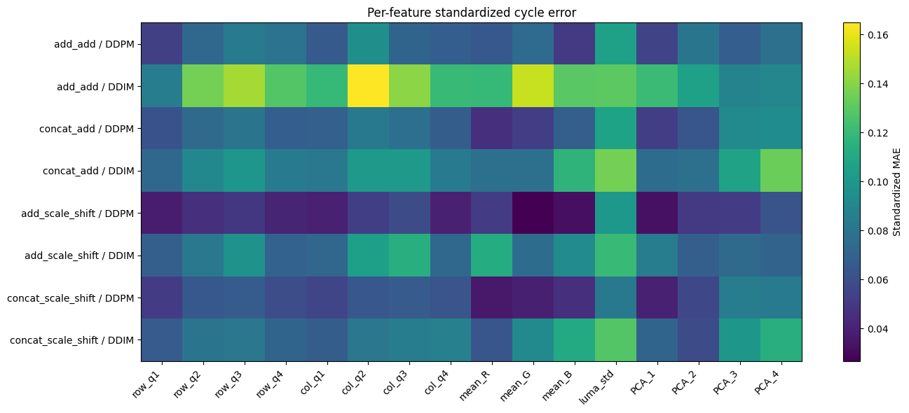
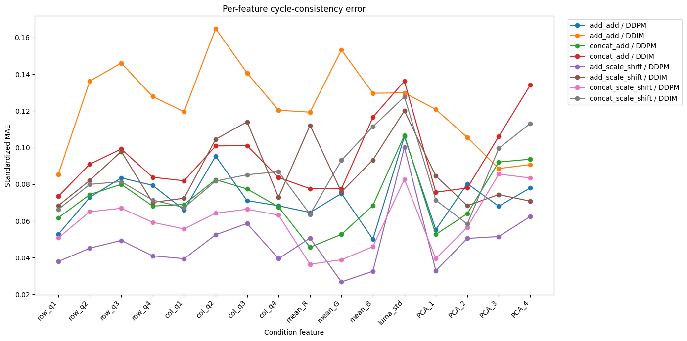
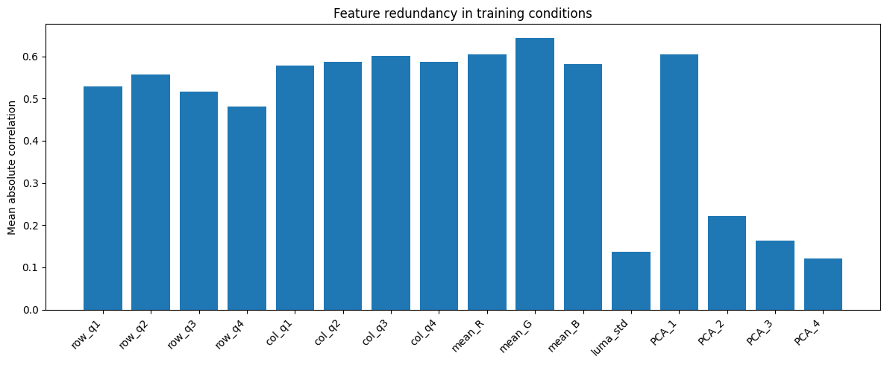
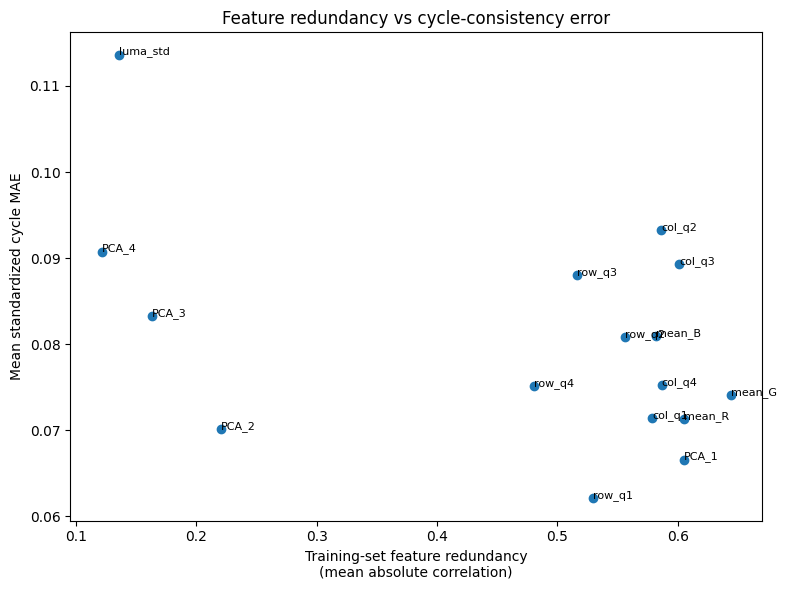

# Conditional DDPM for Cross-modal CIFAR-10 Generation

This project implements a conditional diffusion model from scratch in PyTorch for generating CIFAR-10 images from a deterministic 16-dimensional pseudo-crossmodal conditioning vector.

Four conditioning architectures are compared, followed by cycle-consistency analysis and a DDPM-vs-DDIM sampling study across multiple inference budgets.

The main finding is that scale-and-shift conditioning improves condition preservation, while semantic class accuracy remains much more limited than low-level conditioning fidelity.

## Setup

The experiments were done in Python3.11.16.

Create a virtual environment and install the requirements.txt:

```bash
pip install -r requirements.txt
```

**Important Note:** To avoid path mismatches, run *all* of the notebooks from the *ROOT* folder.

## Dataset preparation

Run these once, in order, from this directory:

```bash
python prepare_dataset.py     # downloads CIFAR-10, fits PCA, writes dataset.pt
python quality_probe.py       # trains the fixed quality-probe classifier (a few minutes on CPU)
```

After this you will have:

| File | What it is |
|------|------------|
| `data/` | Raw CIFAR-10 cache from torchvision |
| `pca_cache.npz` | PCA fit used by `extract_condition`. **Do not delete or modify.** |
| `dataset.pt` | Paired (image, condition, label) tensors, all three splits |
| `probe_weights.pt` | Frozen CIFAR-10 classifier used as the external quality judge |

All four are gitignored.

## Conditional analysis

Before starting the main task, check the file:

```bash
notebooks/01_conditioning_exploration.ipynb
```

Here you can find the basic analysis of the conditional vectors, like feature-wise distribution analysis, correlations, train/val distribution analysis, etc. And also explanations were needed with a final conclusion.

Some examples from this notebook:

|Feature distribution             |Feature correlation             |
|---------------------------------|--------------------------------|
|||

**Important note (again):** To run this notebook, run it from the *ROOT* directory.

# Task 1

## Model architecture

The blocks like ResBlocks, Upsampling, Downsampling, Attention, as well as the UNet's architecture can be found in the **scripts** folder.

For this task I have implemented and trained 4 models (including one baseline).

The conditional vector and the timestep embedding are fused with either addition:

```bash
t_emb + c_emb -> emb
```

or concatenation + MLP:

```bash
concat(t_emb, c_emb) -> MLP -> emb.
```

There are also 2 types of ResBlocks implemented, based on the embedding injection: via addition and via scale/shift.

So the trained models are:

1. Additive fusion + additive ResBlock conditioning (Baseline) - 9.2M parameters

2. Concatenation + Learned MLP fusion + additive ResBlock conditioning - 9.4M parameters

3. Additive fusion + scale-and-shift modulation - 9.6M parameters

4. Concatenation + Learned MLP fusion + scale-and-shift modulation - 9.8M parameters

All of the models are within the given parameter range. For further details, refer to the corresponding script.

## Training

The training process is described in

``` bash
notebooks/02_training.ipynb
```

The resulting plots are:

|1                   | 2                  | 3                  | 4                  |
|--------------------|--------------------|--------------------|--------------------|
|||||

The training curves are very similar, so denoising loss alone does not clearly distinguish the conditioning mechanisms. The more important question is how well each model preserves the conditioning signal during generation.

### Approximate runtime

On a single NVIDIA T4 GPU:

- One training epoch: ~65–70 seconds
- 30 epochs: ~35 minutes
- 50 epochs: ~55–60 minutes

Dataset preparation and the quality probe only need to be run once.

# Task 2

## Sanity check

After training is done and the checkpoints are saved in the *checkpoints* folder, you can refer to the:

```bash
notebooks/03_sampling.ipynb
```

for the task's second sub-level.

Note, that the sampling implementations are in the following script:

```bash
scripts/samplers.py
```

To run test or just review the process itself, refer to the third notebook.

**Important:** Run the notebook from the repo ROOT.

You can access to the folder with my trained weights [here](https://drive.google.com/drive/folders/1zuBAkqO_105zWoxoBhuH2KDgCKb5E_LP?usp=sharing).

# Task 3

## Intro to the Cycle-consistency evaluation.

The goal of this evaluation is to measure how well the generated image preserves the information contained in the 16-dimensional conditioning vector.

For every conditioning vector $c$ from the held-out CIFAR-10 test set:

1. Generate an image $\hat{x}$.

2. Apply the fixed pseudo-crossmodal extractor to $\hat{x}$.

3. Obtain the reconstructed condition $\hat{c}$.

4. Compare $c$ and $\hat{c}$.

The task defined metric is $||c - \hat{c}||_2.$

Because the 16 conditioning dimensions have different numerical scales (refer to the condition analysis), I also report a standardized version in which each feature error is divided by the training-set standard deviation of that feature. The raw metric is retained as the task-defining quantity, while the standardized metric is useful for comparing feature preservation without high-variance dimensions dominating the result.

## Architecture comparison

For this task I evaluated all four trained architectures using the same held-out conditions, the same initial noise, and the same sampling budget. Also the DDIM model's $\eta$ parameter was set to 0 for the fair comparison and reproducibility.

To run experiments, use the following notebook:

```bash
notebooks/04_evaluation.ipynb
```

The evaluation results were also saved and can be found [here](https://drive.google.com/file/d/1gwXx0cU3qj-t71TF3n4E6t4jOT21qn-v/view?usp=sharing), as well as the csv file with the same [results](https://drive.google.com/file/d/1sp3fgB_8VFTEXZ6Xs7Dm69QKiUOlRjbu/view?usp=sharing).

|Raw                        |Standardized                        |
|---------------------------|------------------------------------|
|||

The main result was that the scale-and-shift ResBlock variants preserved the conditioning signal more accurately than the additive ResBlock variants.

Among the tested models, additive feature fusion + scale-and-shift modulation (noted as 'add_scale_shift') produced the lowest standardized cycle-consistency error and was therefore selected for the sampler comparison in Task 4.

This result is notable because the four models had very similar denoising training/validation losses (refer to the Training sub-heading). The denoising MSE alone therefore did not reveal which architecture made better use of the conditioning vector during generation.

## Which conditioning features are preserved?

Here you can see the feature-wise cycle evaluation for all of the models and inference setups.

|Heatmap (Raw)               |Plot (Raw)                       |
|----------------------------|---------------------------------|
|||

The pre-feature analysis showed that preservation quality is not uniform across the 16 conditioning dimension. Even though the training losses were almost identical, different models preserve the conditions in different ways.

|Heatmap (Standardized)      |Plot (Standardized)      |
|----------------------------|-------------------------|
|||

The per-feature cycle-consistency errors appear to be related to the redundancy of the conditioning representation. The row/column luminance statistics and channel means (features 0–10) are strongly correlated with one another, and most of these features are comparatively well preserved. Because several correlated features encode overlapping information about brightness and color structure, the model has multiple cues from which these properties can be represented during generation.

In contrast, luminance standard deviation (luma_std, feature 11) is only weakly correlated with most other conditioning dimensions and shows one of the largest standardized cycle errors. This suggests that relatively independent information may be harder for the model to preserve: if that information is not represented accurately, there are fewer correlated features that indirectly constrain the generated image toward the correct value.

### Redundancy

To investigate whether these results could be related to the structure of the conditioning space, I computed feature correlations on the training set and defined a simple redundancy score as the mean absolute correlation of each feature with the other 15 dimensions.

|Redundancy                     |Redundancy vs Standardized MAE     |
|-------------------------------|-----------------------------------|
|||

For DDPM, feature redundancy was strongly negatively associated with standardized per-feature reconstruction error:

Spearman $\rho = -0.726, p = 0.0014$.

In other words, conditioning features that were more redundant with the rest of the vector tended to be preseved better by DDPM.

For DDIM, this relationship disappeared:

Spearman $\rho = -0.009, p = 0.974$.

This suggests that redundant conditioning information may be easier to preserve because multiple correlated dimensions provide overlapping constraints on the generated image. More independent features carry information that cannot be recovered as easily from the rest of the condition.

However, redundancy is not a complete explanation. Some features, such as PCA_2, do not follow this pattern, indicating that feature semantics, representation capacity, and sampler dynamics also matter.

## What you may / must not change

- `pseudo_crossmodal.py` is fixed. The conditioning signal must be
  deterministic across runs — do not modify it.
- Everything else (model, training loop, samplers, evaluation notebooks) is
  yours to write.

## Deliverable

Commit one or several Jupyter notebooks plus any supporting `.py` modules,
together with a short top-level README describing how to reproduce your
results (commands, expected runtime, what each notebook produces). See
[TASK.md](TASK.md) for the full prompt and what we look for.
