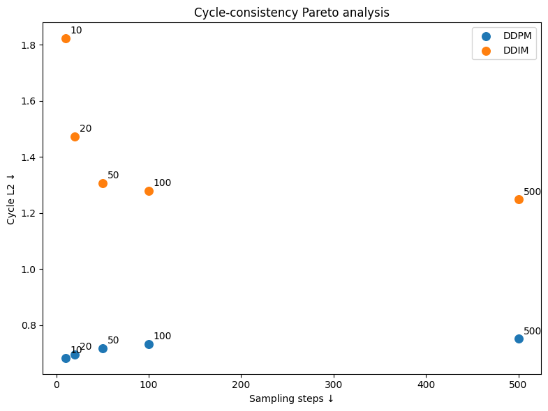
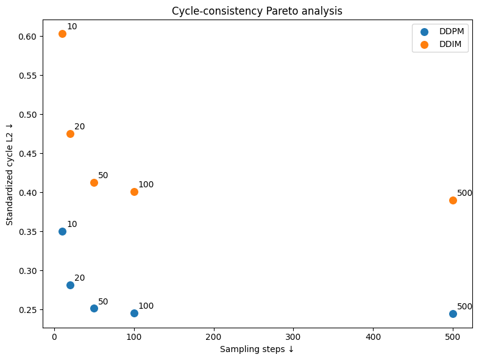
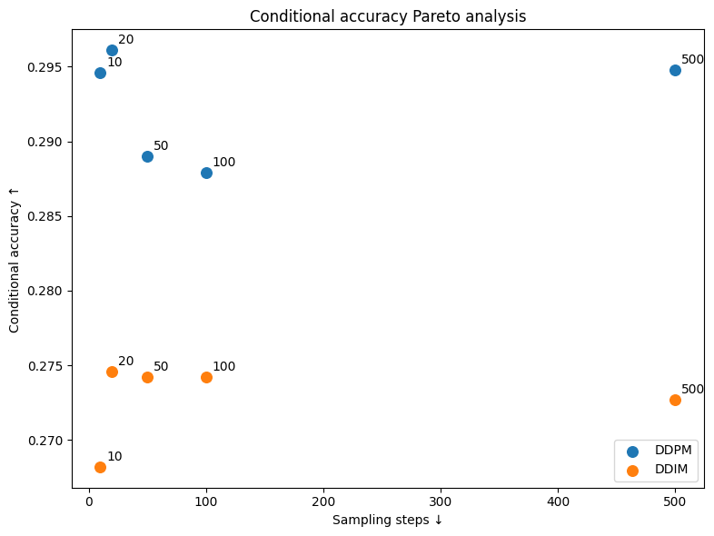

# Conditional DDPM for Cross-modal CIFAR-10 Generation

This project implements a conditional diffusion model from scratch in PyTorch for generating CIFAR-10 images from a deterministic 16-dimensional pseudo-crossmodal conditioning vector.

Four conditioning architectures are compared, followed by cycle-consistency analysis and a DDPM-vs-DDIM sampling study across multiple inference budgets.

The main finding is that scale-and-shift conditioning improves condition preservation, while semantic class accuracy remains much more limited than low-level conditioning fidelity.

## Setup

The experiments were done in Python3.11.16.

Create a virtual environment and install the requirements.txt:

```bash
pip install -r requirements.txt
```

**Important Note:** To avoid path mismatches, run *all* of the notebooks from the *ROOT* folder.

## Dataset preparation

Run these once, in order, from this directory:

```bash
python prepare_dataset.py     # downloads CIFAR-10, fits PCA, writes dataset.pt
python quality_probe.py       # trains the fixed quality-probe classifier (a few minutes on CPU)
```

After this you will have:

| File | What it is |
|------|------------|
| `data/` | Raw CIFAR-10 cache from torchvision |
| `pca_cache.npz` | PCA fit used by `extract_condition`. **Do not delete or modify.** |
| `dataset.pt` | Paired (image, condition, label) tensors, all three splits |
| `probe_weights.pt` | Frozen CIFAR-10 classifier used as the external quality judge |

All four are gitignored.

## Conditional analysis

Before starting the main task, check the file:

```bash
notebooks/01_conditioning_exploration.ipynb
```

Here you can find the basic analysis of the conditional vectors, like feature-wise distribution analysis, correlations, train/val distribution analysis, etc. And also explanations were needed with a final conclusion.

Some examples from this notebook:

|Feature distribution             |Feature correlation             |
|---------------------------------|--------------------------------|
|||

**Important note (again):** To run this notebook, run it from the *ROOT* directory.

# Task 1

## Model architecture

The blocks like ResBlocks, Upsampling, Downsampling, Attention, as well as the UNet's architecture can be found in the **scripts** folder.

For this task I have implemented and trained 4 models (including one baseline).

The conditional vector and the timestep embedding are fused with either addition:

```bash
t_emb + c_emb -> emb
```

or concatenation + MLP:

```bash
concat(t_emb, c_emb) -> MLP -> emb.
```

There are also 2 types of ResBlocks implemented, based on the embedding injection: via addition and via scale/shift.

So the trained models are:

1. Additive fusion + additive ResBlock conditioning (Baseline) - 9.2M parameters

2. Concatenation + Learned MLP fusion + additive ResBlock conditioning - 9.4M parameters

3. Additive fusion + scale-and-shift modulation - 9.6M parameters

4. Concatenation + Learned MLP fusion + scale-and-shift modulation - 9.8M parameters

All of the models are within the given parameter range. For further details, refer to the corresponding script.

## Training

The training process is described in

``` bash
notebooks/02_training.ipynb
```

The resulting plots are:

| add_add            | concat_add         | add_scale_shift    | concat_scale_shift |
|--------------------|--------------------|--------------------|--------------------|
|||||

The training curves are very similar, so denoising loss alone does not clearly distinguish the conditioning mechanisms. The more important question is how well each model preserves the conditioning signal during generation.

### Approximate runtime

On a single NVIDIA T4 GPU:

- One training epoch: ~65–70 seconds
- 30 epochs: ~35 minutes
- 50 epochs: ~55–60 minutes

Dataset preparation and the quality probe only need to be run once.

# Task 2

## Sanity check

After training is done and the checkpoints are saved in the *checkpoints* folder, you can refer to the:

```bash
notebooks/03_sampling.ipynb
```

for the task's second sub-level.

Note, that the sampling implementations are in the following script:

```bash
scripts/samplers.py
```

To run test or just review the process itself, refer to the third notebook.

**Important:** Run the notebook from the repo ROOT.

You can access to the folder with my trained weights [here](https://drive.google.com/drive/folders/1zuBAkqO_105zWoxoBhuH2KDgCKb5E_LP?usp=sharing).

## Samplers

Both samplers use exactly the same trained denoising model.

DDPM ancestral sampling is stochastic because Gaussian noise is injected during the reverse process.

DDIM with $\eta = 0$ is deterministic once the initial noise $x_T$, conditioning vector, model, and timestep schedule are fixed. Therefore the generated image is deterministic with respect to $(c, x_T)$, but not with respect to $c$ alone. Different initial noise tensors can still generate different images for the same condition.

## Reduced-step sampling stability

A naive attempt to use the original adjacent-step DDPM posterior while skipping timesteps was numerically unstable: reduced step samples could explode far outside the training image range.

I therefore implemented the posterior for an arbitrary transition from timestep $t$ to an earlier selected timestep $t_{prev}$. The sampler first reconstructs the predicted clean image $x_0$ and uses it in the generalized posterior.

For reduced-step DDPM and DDIM sampling, the predicted $x_0$ is clipped to the training image range $[-1, 1]$. For DDIM, the predicted noise is recomputed after this clipping so that $x_t$, $x_0$ and $\epsilon$ remain mutually consistent.

This stabilization was necessary for reliable low-step sampling.

# Task 3

## Intro to the Cycle-consistency evaluation.

The goal of this evaluation is to measure how well the generated image preserves the information contained in the 16-dimensional conditioning vector.

For every conditioning vector $c$ from the held-out CIFAR-10 test set:

1. Generate an image $\hat{x}$.

2. Apply the fixed pseudo-crossmodal extractor to $\hat{x}$.

3. Obtain the reconstructed condition $\hat{c}$.

4. Compare $c$ and $\hat{c}$.

The task defined metric is $||c - \hat{c}||_2.$

Because the 16 conditioning dimensions have different numerical scales (refer to the condition analysis), I also report a standardized version in which each feature error is divided by the training-set standard deviation of that feature. The raw metric is retained as the task-defining quantity, while the standardized metric is useful for comparing feature preservation without high-variance dimensions dominating the result.

All Task 3 architecture comparisons use 100 reverse steps.

## Architecture comparison

For this task I evaluated all four trained architectures using the same held-out conditions, the same initial noise, and the same sampling budget. DDIM was evaluated with $\eta = 0$, making its reverse trajectory deterministic for a fixed initial noise tensor. The same initial noise was reused across architectures and samplers to make comparisons reproducible.

To run experiments, use the following notebook:

```bash
notebooks/04_evaluation.ipynb
```

The evaluation results were also saved and can be found [here](https://drive.google.com/file/d/1gwXx0cU3qj-t71TF3n4E6t4jOT21qn-v/view?usp=sharing), as well as the csv file with the same [results](https://drive.google.com/file/d/1sp3fgB_8VFTEXZ6Xs7Dm69QKiUOlRjbu/view?usp=sharing).

|Raw                        |Standardized                        |
|---------------------------|------------------------------------|
|||

The main result was that the scale-and-shift ResBlock variants preserved the conditioning signal more accurately than the additive ResBlock variants.

Among the tested models, additive feature fusion + scale-and-shift modulation (noted as 'add_scale_shift') produced the lowest standardized cycle-consistency error and was therefore selected for the sampler comparison in Task 4.

This result is notable because the four models had very similar denoising training/validation losses (refer to the Training sub-heading). The denoising MSE alone therefore did not reveal which architecture made better use of the conditioning vector during generation.

## Which conditioning features are preserved?

Here you can see the feature-wise cycle evaluation for all of the models and inference setups.

|Heatmap (Raw)               |Plot (Raw)                       |
|----------------------------|---------------------------------|
|||

The pre-feature analysis showed that preservation quality is not uniform across the 16 conditioning dimension. Even though the training losses were almost identical, different models preserve the conditions in different ways.

|Heatmap (Standardized)      |Plot (Standardized)      |
|----------------------------|-------------------------|
|||

The per-feature cycle-consistency errors appear to be related to the redundancy of the conditioning representation. The row/column luminance statistics and channel means (features 0–10) are strongly correlated with one another, and most of these features are comparatively well preserved. Because several correlated features encode overlapping information about brightness and color structure, the model has multiple cues from which these properties can be represented during generation.

In contrast, luminance standard deviation (luma_std, feature 11) is only weakly correlated with most other conditioning dimensions and shows one of the largest standardized cycle errors. This suggests that relatively independent information may be harder for the model to preserve: if that information is not represented accurately, there are fewer correlated features that indirectly constrain the generated image toward the correct value.

### Redundancy

To investigate whether these results could be related to the structure of the conditioning space, I computed feature correlations on the training set and defined a simple redundancy score as the mean absolute correlation of each feature with the other 15 dimensions.

|Redundancy                     |Redundancy vs Standardized MAE     |
|-------------------------------|-----------------------------------|
|||

For DDPM, feature redundancy was strongly negatively associated with standardized per-feature reconstruction error:

Spearman $\rho = -0.726, p = 0.0014$.

In other words, conditioning features that were more redundant with the rest of the vector tended to be preseved better by DDPM.

For DDIM, this relationship disappeared:

Spearman $\rho = -0.009, p = 0.974$.

This suggests that redundant conditioning information may be easier to preserve because multiple correlated dimensions provide overlapping constraints on the generated image. More independent features carry information that cannot be recovered as easily from the rest of the condition.

However, redundancy is not a complete explanation. Some features, such as PCA_2, do not follow this pattern, indicating that feature semantics, representation capacity, and sampler dynamics also matter.

# Task 4

## Intro to the Quality / Steps trade-off

Task 4 focuses on inference. Based on the Task 3 results, I selected the  **add_scale_shift** model and kept it fixed for every experiment.

I compared DDPM ancestral sampling and deterministic DDIM ($\eta = 0$) at {500, 100, 50, 20, 10} reverse steps.

For fairness, all configurations use the same:

- held-out test conditions,
- test labels,
- inital Gaussian noise,
- trained model,
- condition normalizing,
- fixed external classifier probe.

For the detailed overview, refer to the following notebook:

```bash
notebooks/05_pareto.ipynb
```

## Metrics used

Two quality measures are reported:

1. **Cycle consistency** (From task 3) - how closely the condition extracted from the generated image matches the original conditioning vector.

2. **Conditional classifier accuracy** - whether the fixed CIFAR-10 probe assigns the generated image the same class label as the source image from which the condition was derived.

The classifier label is used only for evaluation. It is never given to the diffusion model as a conditioning input (as requested by the task).

### Probe baseline

The quality probe reaches approximately 75.8% accuracy on the real CIFAR-10 test set. This provides a practical reference for interpreting generated-image classification accuracy.

## Results

You can find my results [here](https://drive.google.com/file/d/1xYZyvmVC14QT-8A2J9erKpqVoWwYh8zY/view?usp=sharing)

|Sampler |Steps |Cycle L2 |Standardized cycle L2 |Conditional Accuracy|
|--------|------|---------|----------------------|--------------------|
|DDPM    |500   |0.7514   |0.2448                |0.2948              |
|DDPM    |100   |0.7318   |0.2457                |0.2879              |
|DDPM    |50    |0.7182   |0.2513                |0.2890              |
|DDPM    |20    |0.6949   |0.2812                |0.2961              |
|DDPM    |10    |0.6836   |0.3505                |0.2946              |
|--------|------|---------|----------------------|--------------------|
|DDIM    |500   |1.2483   |0.3897                |0.2727              |
|DDIM    |100   |1.2788   |0.4007                |0.2742              |
|DDIM    |50    |1.3065   |0.4129                |0.2742              |
|DDIM    |20    |1.4738   |0.4750                |0.2746              |
|DDIM    |10    |1.8226   |0.6032                |0.2682              |

### Cycle-consistency trade-off

Using the standardized cycle metric, DDPM outperformed DDIM at every tested step count.

For DDPM, most of the available cycle-consistency quality was already reached by 50-100 steps. Increasing the budged from 100 to 500 steps reduced standardized cycle error only approximately 0.246 to 0.245, despite requiring 5x more reverse-model evaluations.

Below 50 steps, the degradation became much more visible, particularly at 10 steps.

DDIM degraded more strongly as the step budget was reduced and remained worse than DDPM at every matched step count in this experiment.

|Raw                    |Standardized                        |
|-----------------------|------------------------------------|
|||

The raw and standardized cycle metrics show different trends for DDPM. This is not a contradiction: the raw Euclidean norm is dominated by higher-scale conditioning dimensions, while standardized gives each feature comparable weight.

For that exact reason I report both:

1. Raw L2 for direct compliance with the task definition,

2. Standardized L2 as a scale-balanced diagnostic.

From the standardized cycle-consistency perspective, DDIM is dominated by DDPM: at every matched budget, DDPM achieves lower standardized cycle error. For DDPM, 50-100 steps provide the most attractive region of the trade-off: 500 steps require substantially more computation for almost no additional standardized cycle-consistency benefit.

### Conditional classifier accuracy

Classification accuracy behaved very differently from cycle consistency.

DDPM remained around 29% accuracy across all tested step budgets, while DDIM remained around 27%. Increasing the number of steps did not produce a systematic improvement in semantic class agreement.

For example, 20-step DDPM slightly exceeded 500-step DDPM in measured classification accuracy, but the difference is only about 0.1 percentage points and is too small to interret as a genuine quality improvement.

This usggests that additional reverse sampling steps improve preservation of the 16-dimensional pseufo-crossmodal condition much more than they improve CIFAR-10 semantic fidelity.

|Classifier accuracy     |
|------------------------|
||

The relatively low classifier accuracy does not contradict with the denoising loss of approximately 0.05.

The diffusion model is trained to predict injected noise, not to predict the label. A low noise-prediction MSE therefore does not imply that the generated image must preserve high-level semantic class identity.

The conditioning vector also does not explicitly contain a class label. It contains deterministic image statistics such as luminance summaries, RGB means, luminance variation, and PCA components. These statistics contain some semantic information, but they do not uniquely determine a CIFAR-10 class.

This explains why cycle consistency can improve while classifier accuracy remains almost unchanged.

Increasing the sampling budget provides no clear benefit. The small differences between DDPM step counts are too small to interpret as meaningful improvements, so expensive configurations such as 500-step DDPM are difficult to justify based on semantic accuracy alone.

## Main findings

1. **Training loss was not sufficient for model selection.**
All four architectures had similar denoising losses, but their ability to preserve the condition during generation differed substantially.

2. **Scale-and-shift conditioning worked best.**
The additive-fusion + scale-and-shift model gave the strongest cycle consistency and was selected for the sampler study.

3. **Feature preservation is structured.**
Some conditioning dimensions are much easier to preserve than others. For DDPM, highly redundant features tended to have lower reconstruction error.

4. **DDPM was stronger than DDIM for cycle consistency in this setup.**
At the same sampling budgets, DDPM produced lower standardized cycle error across all tested step counts.

5. **50-100 DDPM steps capture most of the cycle consistency benefit.**
Increasing from 100 to 500 steps adds substantial compute for almost no improvement in standardized cycle error.

6. **Semantic class fidelity is much more limited than low-level condition fidelity.**
The fixed classifier achieves about 75.8% accuracy on real CIFAR-10 test images, while generated samples achieve only about 27-30%.

7. **More reverse steps do not solve the semantic limitation.**
Conditional accuracy remains nearly flat across sampling budgets, suggesting that the bottleneck is primarily the information represented by the pseudo-crossmodal condition and/or how strongly the model uses it, rather than insufficient reverse-sampling computation.

## Limitations and next steps

The main limitation here is that the 16-dimensional pseudo-crossmodal representation does not explicitly encode CIFAR-10 class identity. As a result, good cycle-consistency does not necessarily imply semantic agreement.

With more time or compute, I would investigate:

- classifier-free guidance or stronger conditioning injection to test whether the model is under-using the condition,

- repeated stochastic DDPM evaluations to attch uncertainty estimates to the classifier metric,

- per-class confusion matrices to understand which semantic classes are preserved or confused,

- perceptual image-quality metrics in addition to the supplied classifier,

- whether the raw/standardized cycle discrepancy can be traced to specific high-variance condition dimensions.

