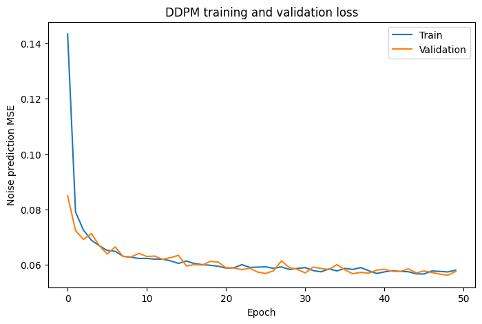

# Test task

## Step 0: Set up

The experiments were done in Python == 3.11.16.

Create a virtual environment and install the requirements.txt:

```bash
pip install -r requirements.txt
```

**Important Note:** To avoid path mismatches, run *all* of the notebooks from the *ROOT* folder.

## Step 1: Dataset preparation

Run these once, in order, from this directory:

```bash
python prepare_dataset.py     # downloads CIFAR-10, fits PCA, writes dataset.pt
python quality_probe.py       # trains the fixed quality-probe classifier (a few minutes on CPU)
```

After this you will have:

| File | What it is |
|------|------------|
| `data/` | Raw CIFAR-10 cache from torchvision |
| `pca_cache.npz` | PCA fit used by `extract_condition`. **Do not delete or modify.** |
| `dataset.pt` | Paired (image, condition, label) tensors, all three splits |
| `probe_weights.pt` | Frozen CIFAR-10 classifier used as the external quality judge |

All four are gitignored.

## Step 2: Conditional analysis

Before starting the main task, check the file:

```bash
notebooks/01_conditioning_exploration.ipynb
```

Here you can find the basic analysis of the conditional vectors, like feature-wise distribution analysis, correlations, train/val distribution analysis, etc. And also explanations were needed with a final conclusion.

**Important note (again):** To run this notebook, run it from the *ROOT* directory.

## Step 3: Model architecture

The blocks like ResBlocks, Upsampling, Downsampling, Attention, as well as the UNet's architecture can be found in the **scripts** folder.

For this task I have implemented and trained 4 models (including one baseline).

The conditional vector and the timestep embedding are fused with either addition:

```bash
t_emb + c_emb -> emb
```

or concatenation + MLP:

```bash
concat(t_emb, c_emb) -> MLP -> emb.
```

There are also 2 types of ResBlocks implemented, based on the embedding injection: via addition and via scale/shift.

So the trained models are:

1. Additive fusion + additive ResBlock conditioning (Baseline) - 9.2M parameters

2. Concatenation + Learned MLP fusion + additive ResBlock conditioning - 9.4M parameters

3. Additive fusion + scale-and-shift modulation - 9.6M parameters

4. Concatenation + Learned MLP fusion + scale-and-shift modulation - 9.8M parameters

All of the models are within the given parameter range. For further details, refer to the corresponding script.

## Step 4: Training

The training process is described in

``` bash
notebooks/02_training.ipynb
```

The resulting plots are:

|1                   | 2                  | 3                  | 4                  |
|--------------------|--------------------|--------------------|--------------------|
|||||

The training curves are very similar, so denoising loss alone does not clearly distinguish the conditioning mechanisms. The more important question is how well each model preserves the conditioning signal during generation.

### Approximate runtime

On a single NVIDIA T4 GPU:

- One training epoch: ~65–70 seconds
- 30 epochs: ~35 minutes
- 50 epochs: ~55–60 minutes

Dataset preparation and the quality probe only need to be run once.

## What you may / must not change

- `pseudo_crossmodal.py` is fixed. The conditioning signal must be
  deterministic across runs — do not modify it.
- Everything else (model, training loop, samplers, evaluation notebooks) is
  yours to write.

## Deliverable

Commit one or several Jupyter notebooks plus any supporting `.py` modules,
together with a short top-level README describing how to reproduce your
results (commands, expected runtime, what each notebook produces). See
[TASK.md](TASK.md) for the full prompt and what we look for.
